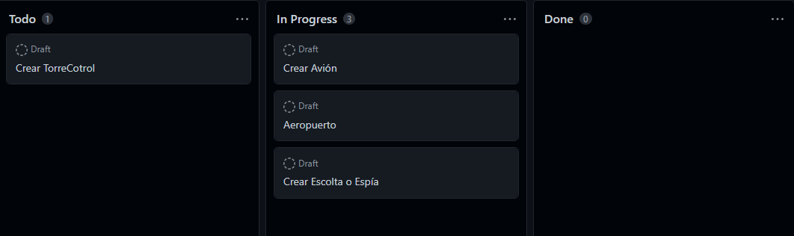

# Creación de la Arquitectura

Primero tuvimos que separar las principales clases que veíamos a primera vista que deberúiamos tener en el proyecto si o si.

En una primera instancia pudimos sacar Avión, Escolta o Espía y un Aeropuerto.

<figure><figcaption><p>Inicio del proyecto</p></figcaption></figure>

Tomamos como patrón de diseño el patrón observador, el cuál consta de un objeto principal, que será nuestro avión, y una o unas clases dependientes, que será nuestra clase escolta. Con esto conseguimos resolver la forma de diseñar nuestro proyecto con éxito.

El éxito de uso de este patrón de diseño es que cuando el objeto principal, sea este nuestro avión, sufra o realice un cambio estado, éste se notificará a nuestros observadores que son dependientes de estos cambios de estado y por tanto se activará la llamada update() en el escolta para poder copiar la ruta de nuestro avión.

Aquí veremos principalmente como funcionará y se lanzará nuestro avión principal el cuál corresponde a nuestra clase "Primario"

```java
public void run() {
        //se genera un identificador de vuelo
        genIdentificador();
        //primero se obtiene un plan de vuelo
        plan();
        //luego se obtiene la ruta
        ruta(lat1, lng1, lat2, lng2);
        //empezar vuelo
        vuelo();
        notificarTorre(/*rutas*/);
    }
```

Tenemos nuestro método run(), dónde a nuestro avión principal se le otorgará un ID para trackear su vuelo, después hace un plan de vuelo y se calculará la ruta en función al plan seleccionado, sea ésta ruta establecida en función a las coordenadas de los origen y destino del viaje.

```java
//  private void plan() {
        //crear plan de vuelo estableciendo origen y destino
        boolean iguales = true;
        int ori = 0;
        int des = 0;
        //generar numero aleatorio para el id entre 1 y 5
        while (iguales) {
            ori = (int) (Math.random() * 5 + 1);
            des = (int) (Math.random() * 5 + 1);
            if (ori != des) {
                iguales = false;
            }
        }
```

Una vez generados estos datos y establecida la ruta el avión principal puede empezar su vuelvo y poco más tarde se notificará  a nuestra clase TorreControl la ruta de vuelo primaria.

Por ello nos fijamos de la necesidad de crear la clase TorreControl, en la cuál desarrollaremos nuestra asignación de un escolta a nuestro avión principal y el update() de la ruta que toma el principal en nuestro observador escolta.

Queremos recalcar el uso de datos reales para la simulación de estos vuelos sea lo más parecido a un vuelo comercial. Por ello las coordenadas son los más precisas posibles y la velocidad de nuestros aviones parecidas a lo que tardaría el vuelo entre el destino y origen.

Así podremos apreciar como le persigue este 2ºAvión. En caso de un cambio de ruta sería posible que nuestro escolta sería capaz de volver a cargar la ruta gracias a la notificación recibida por el cambio de estado(la nueva ruta a seguir/trackear)


<figure><figcaption><p>Gestión del proyecto 1</p></figcaption></figure>

También nuestro aeropuerto que en principio era como gestión de datos principal que se convirtió en llamadas a nuestra API en función al destino de nuestro avión, en ella encontraremos la geolocalización de todos ellos además de una etiqueta clave.


