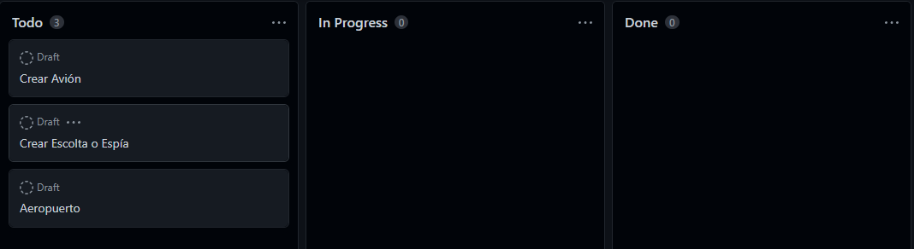

# Creación de la Arquitectura

Primero tuvimos que separar las principales clases que veíamos a primera vista que deberúiamos tener en el proyecto si o si.

En una primera instancia pudimos sacar Avión, Escolta o Espía y un Aeropuerto.

<figure><figcaption>
Inicio del proyecto
</figcaption></figure>
